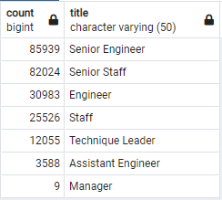
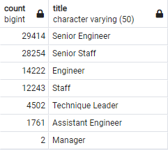

# Pewlett-Hackard-Analysis
This project analyzes the the coming "silver tsunami" at Pewlett Hackard, a 240124-person company with an aging workforce.

## Project Overview
Using SQL with Postgres, 6 csv files were analyzed to find how many employees will be aging into retirement eligibility in the near future, as well as identifying areas that may be hard pressed with the loss of workers to retirement. Additionally, the project analyzes the viability of a mentorship program that encourages retirement-eligibile employees to move to part-time work, mentoring the next generation of PH employees.

## Results
Pewlett Hackard can expect to suffer a significant setback from loss of institutional knowledge in the coming years. Over 1/3 of all PH employees will be reaching retirement age in the next 3 years.

Total PH Employees by Title

PH Employees Entering Retirement Age In the Next Three Years

- In most categories, roughly 1/3 of employees will be eligibile for retirement in the next 3 years
-- For Staff, Engineer, and Assitant Engineer positions, that number is almost 1/2
- Curiously, less than 1% of current employees were born in 1965. If the mentorship program relies on employees born in this year alone to offset the loss of retiring employees, it will be grossly wanting.
- PH will need a significant external hiring push to offset this loss.

## Summary
PH is looking at the retirement of 90,398 employees in the next three years, over 37.6% of its total workforce. With only 1,549 employees eligible for the mentorship program as described (born in 1965), PH is NOT ready for the silver tsunami that is about to hit the company. 
